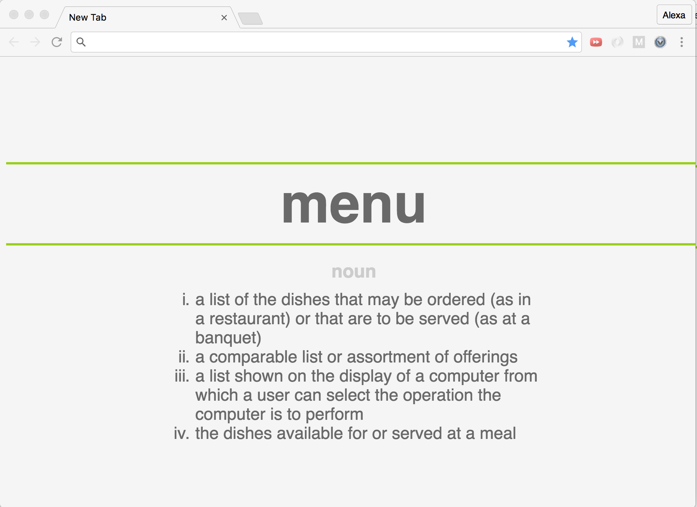

# Vocab-U-List

#### [Chome Store][ChromeStore]
[ChromeStore]: https://chrome.google.com/webstore/detail/vocab-u-list/lbganapgpokemopcohijojgcpjamicle

## Background
Vocab-U-List is a Chrome Extension that helps users improve their vocabulary.  It allows users to select a word on a page that they are unfamiliar with and add it to their own personal vocabulary dictionary. Whenever the user opens a new window or tab one of the words from their vocabulary dictionary will be shown on the page along with its definition.

## Basic Framework:
-	Right click on highlighted word to add to word-list
-	Adds word and URL to database
-	Makes ajax request to Mirrem-Webster dictionary for definition
-	Adds the word’s definition to database
-	Upon open of new tab/window
- Fetches random word from database
- Html renders word and definition
-	User learns new words

## Wireframes

## Technologies Used
This extension will be implemented using the standard Chrome extension technology -  Javascript, HTML, and CSS.

In addition to the `manifest.json` file, there will be two scripts:
-	`content.js`: will contain the logic for finding the selected word
-	`background.js`: logic for the context menu and finding and saving word information

There will also be one file to display the content:
-	`new_tab.html`: renders a new tab with word, type and definition

## FunctionaListy & MVP
#### With this extension, users will be able to:
-	Select a word they do not know and add it to their personal word list
-	See a random word on their list, with its definition and URL when they open a new tab/window
-	Increase their vocabulary through consistent visualization!

#### Bonus Features:
-	Button to remove word from word list
-	Link to show all words and their definitions on one page
